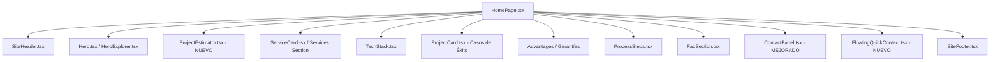

# Especificación Técnica: Sistema de Captación y Conversión de Clientes para OKCODE

- **Fecha**: 2026-09-01
- **Estado**: Propuesta para Aprobación
- **Objetivo**: Transformar el sitio web de OKCODE (`okcode.es`) en una plataforma de alta conversión para captación de clientes B2B (Startups y Pymes), incorporando un estimador interactivo de proyectos, canales de contacto sin fricción (WhatsApp directo, Telegram, email asistido) y una propuesta de valor de alto impacto en 3 idiomas (Español, Inglés, Chino).

---

## 1. Objetivos de Negocio y Conversión

1. **Público Objetivo Principal**: Startups y Pymes que necesitan lanzar un MVP rápido, desarrollar una web/aplicación a medida o digitalizar su negocio con código 100% propio y plazos garantizados.
2. **Reducción de Fricción en Contacto**: Sustituir el `mailto:` tradicional por un ecosistema multicanal:
   - **WhatsApp Corporativo Directo**: `+34 684 25 21 30` con mensaje de inicio contextualizado según la selección del usuario.
   - **Telegram Directo**: Canal de soporte y mensajería rápida para clientes internacionales y desarrolladores.
   - **Email Profesional Asistido**: `info@okcode.es` (configurado mediante Cloudflare Email Routing hacia `wenhlin7@gmail.com`) con botón de copiado de datos al portapapeles y confirmación visual inmediata.
3. **Lead Magnet Interactivo**: Incorporar una **Calculadora / Estimador de Alcance y Presupuesto de Proyecto** que permita al cliente cotizar su idea en 30 segundos y compartirla directamente por WhatsApp o email.

---

## 2. Arquitectura de Información y Contenido Trilingüe

El archivo `src/content/site-content.ts` se actualizará con los nuevos textos en **Español**, **Inglés** y **Chino Mandarín**:

### 2.1. Propuesta de Valor (Hero Section)
- **Claim Principal**: *"De idea a producto digital listo para producción en 3-4 semanas."*
- **Subtítulo**: *"Desarrollamos aplicaciones web, apps móviles y plataformas escalables para startups y empresas. Código 100% de tu propiedad, sin dependencias y con garantía de entrega."*
- **4 Garantías Clave (Risk Reversal Badges)**:
  1. `100% Código Tuyo` (Sin vendor lock-in ni comisiones de plataforma).
  2. `Presupuesto Cerrado` (Sin costes ocultos ni sorpresas).
  3. `30 Días de Soporte Gratis` (Garantía post-lanzamiento incluida).
  4. `Acuerdo de Confidencialidad (NDA)` (Protección total de tu propiedad intelectual).

### 2.2. Servicios Paquetizados (Productized Packages)
1. **MVP Launchpad (Startups)**: Prototipo funcional, frontend reactivo, backend/base de datos y despliegue en 3-4 semanas.
2. **Web & Plataforma a Medida**: Next.js 15, panel administrativo, SEO 100/100 y arquitectura escalable.
3. **E-Commerce & Digitalización**: Shopify Headless / WooCommerce, pasarelas de pago (Stripe, Bizum, WeChat Pay) y automatización.
4. **App Móvil Multiplataforma**: React Native / Expo para iOS y Android con una sola base de código optimizada.

### 2.3. Estimador de Proyectos (`estimator`) en el Modelo de Contenido
Se añade una sección estructurada `estimator` al tipo `SiteContent`:
- Categorías de proyecto (MVP, Web, E-Commerce, App Móvil).
- Opciones de funcionalidades (Auth, Pagos, Panel Admin, IA/API, Multiidioma).
- Tiempos de entrega estimados (Express < 3 sem, Estándar 1-2 meses, A medida).
- Textos y etiquetas en ES, EN y ZH.

---

## 3. Arquitectura de Componentes

### 3.1. Nuevo Componente: `ProjectEstimator.tsx`
- **Ubicación**: `src/components/ProjectEstimator.tsx`
- **Comportamiento**:
  - Selector por pasos interactivo (Tabs o Cards seleccionables).
  - Cálculo dinámico del resumen del proyecto (Alcance estimado, stack recomendado, plazo orientativo).
  - Acciones de conversión directa:
    - Botón **"Consultar por WhatsApp"**: Abre `https://wa.me/34684252130?text=...` con el resumen formateado.
    - Botón **"Enviar por Email"**: Abre el cliente de correo y además copia el resumen al portapapeles.

### 3.2. Mejora del Componente: `ContactPanel.tsx`
- Se incluye selector de canal:
  - Enlace directo a WhatsApp corporativo (`+34 684 25 21 30`).
  - Enlace directo a Telegram (`https://t.me/+34684252130` o `@okcode_es`).
  - Correo directo: `info@okcode.es` con botón de 1 clic para copiar la dirección.
- En el envío del formulario:
  - Generación de asunto y cuerpo claro.
  - Notificación Toast/Feedback accesible que confirma la acción: *"¡Datos preparados! Abriendo tu correo..."*.

### 3.3. Nuevo Componente: `FloatingQuickContact.tsx`
- Botón flotante discreto y no intrusivo en la esquina inferior para iniciar conversación inmediata por WhatsApp o abrir el modal de estimación rápida.
- Ocultable o adaptable en móvil según el scroll para no interferir con la lectura.

---

## 4. Estilos y Sistema de Diseño

- **Fidelidad al Contexto Visual de OKCODE (`.impeccable.md`)**:
  - Mantener la paleta sobria: Fondo tinta profunda (`oklch(0.14 0.02 260)`), acentos azul/violeta estructurados, tipografías limpias y alto contraste.
  - Tarjetas interactivas con estados de foco visibles (`:focus-visible`), bordes sutiles con gradiente tenue y microinteracciones de feedback inmediato.
- **Accesibilidad & Estándares WCAG 2.1**:
  - Roles ARIA adecuados en el estimador (`role="radiogroup"`, `aria-checked`, botones con etiquetas accesibles).
  - Soporte estricto de `prefers-reduced-motion`.
  - Contraste mínimo de 4.5:1 en todos los textos y botones de acción.

---

## 5. Criterios de Calidad y Verificación

1. **TypeScript**: `npm run typecheck` (`tsc --noEmit`) sin errores.
2. **Build Estático**: `npm run build` genera la salida estática en `./out` para `/`, `/es/` y `/zh-cn/` sin errores de hidratación.
3. **Consistencia i18n**: Las 3 rutas (`/`, `/es/`, `/zh-cn/`) deben renderizar sus contenidos en sus respectivos idiomas sin textos en inglés residuales.
4. **Verificación de Enlaces y Conversión**: Comprobar que los enlaces a WhatsApp (`wa.me/34684252130`), Telegram y email (`info@okcode.es`) funcionan y tienen textos codificados correctamente.
